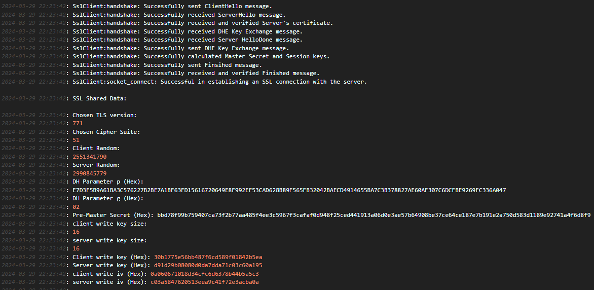
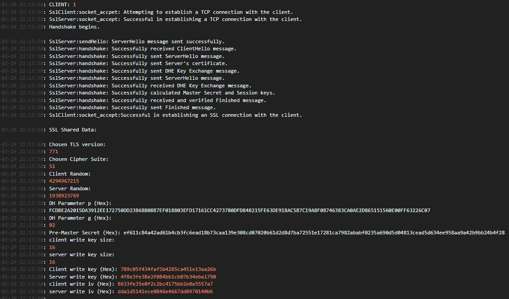
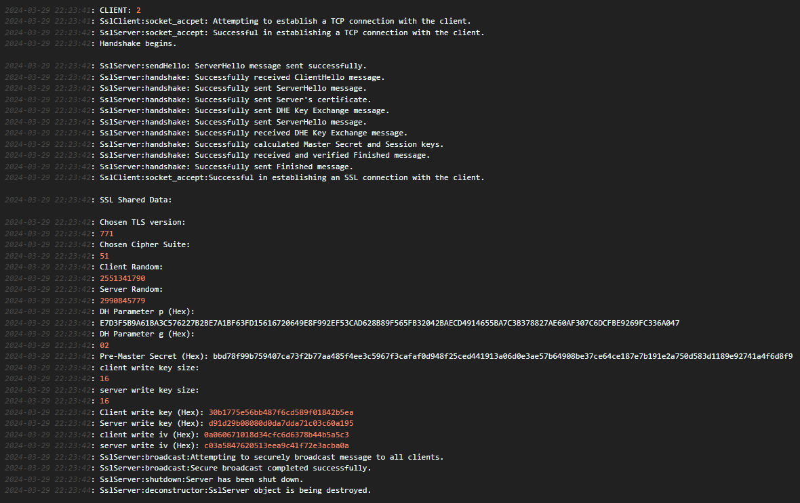
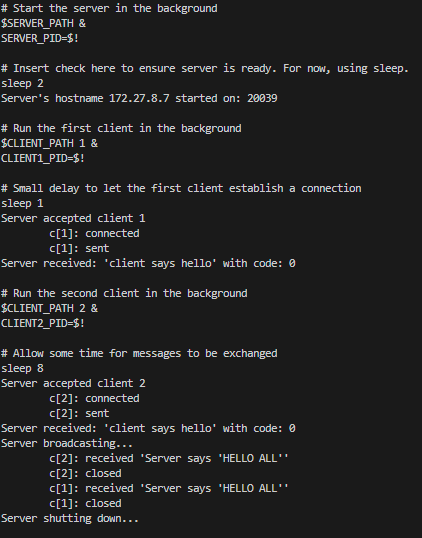
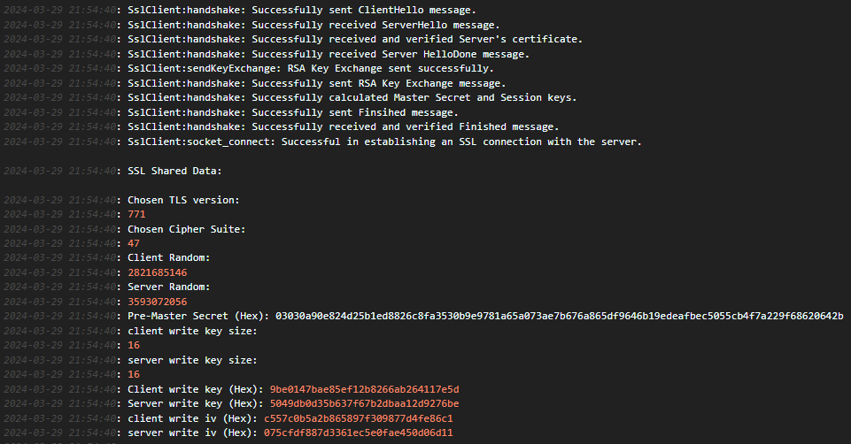
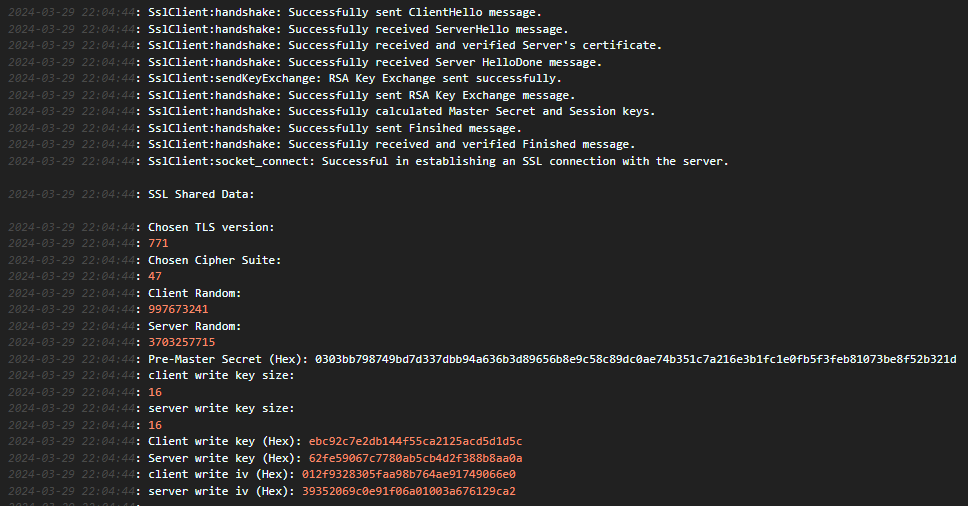
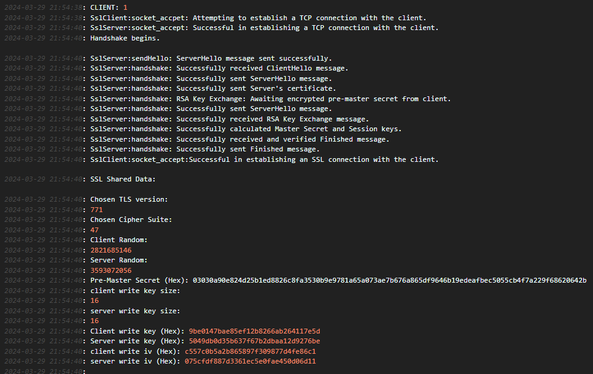
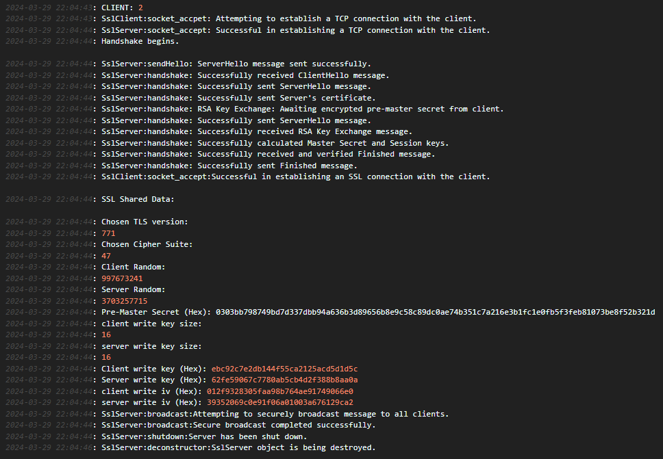
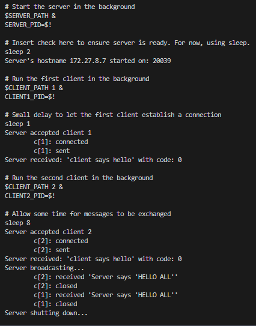

# 🛡️ TLS/SSL Handshake Simulation

This project simulates the TLS/SSL handshake process, demonstrating how secure communication is established between a client and a server using both **DHE (Diffie-Hellman Ephemeral)** and **RSA** key exchange mechanisms.

The implementation logs detailed handshake steps, key generation, and secure message exchange to help visualize the protocol under the hood.

---

## 📌 Features

- TLS Version 1.2 (version code 771)
- Cipher Suites: 0x0033 (DHE_RSA_WITH_AES_128_CBC_SHA), 0x002F (RSA_WITH_AES_128_CBC_SHA)
- DHE and RSA key exchange support
- Secure socket-based communication in C/C++
- Pre-master and master secret derivation
- Generation of:
  - Client/Server write keys
  - Client/Server IVs (Initialization Vectors)
- Secure broadcast messaging from server to multiple clients after handshake
- Extensive logging for both server and clients

---

## 🔧 How It Works

1. Client initiates the handshake with a `ClientHello`.
2. Server responds with a `ServerHello` and certificate.
3. Key Exchange:
   - **DHE Mode**: Server and client exchange DH public values.
   - **RSA Mode**: Client sends encrypted pre-master secret using server's public key.
4. Both derive a shared master secret and generate session keys.
5. Final `Finished` messages are exchanged and verified.
6. Secure communication begins.

---

## 🧪 Terminal Logs & Screenshots

### 🔄 DHE Key Exchange Simulation

#### 📸 Client 1 DHE Handshake Log
  
*Shows full client-side DHE handshake including key generation and session keys.*

#### 📸 Client 2 DHE Handshake Log
  
*Similar handshake log from second client to simulate multiple connections.*

#### 📸 Server Log - Client 1
  
*Server-side view of full handshake with client 1 using DHE.*

#### 📸 Server Log - Client 2
  
*Server handshake processing with client 2 using DHE parameters.*

#### 📸 DHE Broadcast Terminal Output
  
*Server accepts clients, performs handshake, then securely broadcasts messages to all.*

---

### 🔐 RSA Key Exchange Simulation

#### 📸 Client 1 RSA Handshake Log
  
*Client logs showing encrypted pre-master secret exchange via RSA.*

#### 📸 Client 2 RSA Handshake Log
  
*Second client initiates handshake with RSA key exchange.*

#### 📸 Server Log - Client 1
  
*Server logs handshake with first client using RSA public-private key pair.*

#### 📸 Server Log - Client 2
  
*Same for second client, showing full message exchange.*

#### 📸 RSA Broadcast Terminal Output
  
*Demonstrates secure message broadcasting after successful RSA-based sessions.*

---

## 📄 Sample Output

```text
SSL Shared Data:
Chosen TLS version: 771
Chosen Cipher Suite: 51
Client Random: 4294967215
Server Random: 1983923769
DH Parameter p (Hex): FCD8E2A2015DA3911EE217750D2D386808B7EF018803EFD1761CC...
DH Parameter g (Hex): 02
Pre-Master Secret (Hex): ef611c84a42ad61b4cb3fc6ead18b73caa139e...
Client write key: 789c5f434faf5b4285ca451e13aa26b
Server write key: 4f8e3fe382ef084bb1cb07b34eba1790
Client IV: 8633f5e30ef2cb4c4175bb2e0a5557a7
Server IV: ddad1541ece0846e4667dd0970140b6

---

## 🛠️ Built With

    C/C++

    Socket Programming

    TLS/SSL protocol logic (manually implemented)

    Diffie-Hellman Key Exchange (DHE)

    RSA encryption


▶️ How to Run

    Start the server in the background

    Run the client(s) in parallel

    Observe:

        Handshake logs

        Key derivation

        Encrypted message broadcast

    Switch between DHE and RSA key exchange as needed
